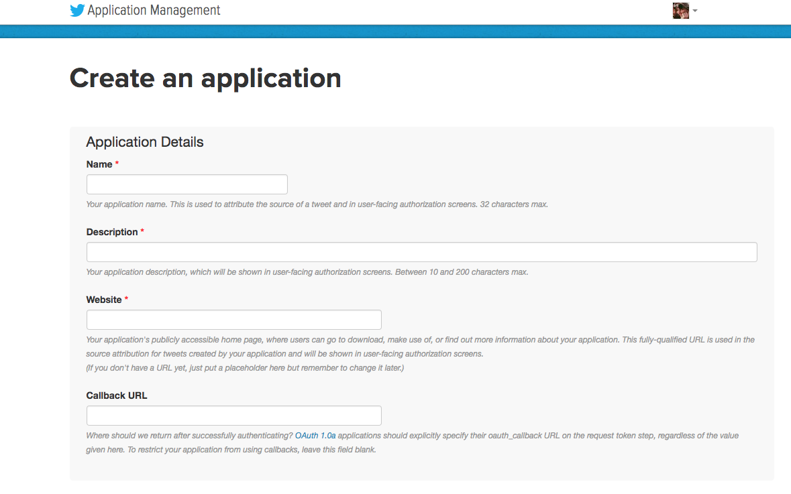

# HashTagFinder

This is an application created to find trending hashtags in specific locations.

This is an Epicodus Group Project for JS that focuses on API development.

## SET UP

* clone repo
* go to https://app.twitter.com/app/new
* you will have to sign in using your twitter account.
* 
* you will be given a Consumer Key and a Consumer Secret.
* create server/config.js:

```
var appsettings = {
    consumerkey: '<yourconsumerkey>',
    consumersecret: '<yourconsumersecret>',
    bearertoken: ''
};

module.exports = appsettings;
```
* you will need to open two terminals and open server in one terminal and client in another terminal.
* navigate to the server folder and run `npm start`
* navigate to client folder and run `ng serve`
* Open localhost:4200 in your favorite browser

### Techologies Used

```
Angular 2
Firebase
Node.js
JavaScript/TypeScript
Twitter API
```

## Authors
* **Kate Trahan** - [katetrahan](https://github.com/katetrahan)
* **Natalia Tepukhova** - [telpuhova](https://github.com/telpuhova)
* **Byron Chang** - [thebyronc](https://github.com/thebyronc)
* **Jun Li** - [june11084](https://github.com/june11084)

## Development server

Run `ng serve` for a dev server. Navigate to `http://localhost:4200/`. The app will automatically reload if you change any of the source files.

## Code scaffolding

Run `ng generate component component-name` to generate a new component. You can also use `ng generate directive/pipe/service/class/module`.

## Build

Run `ng build` to build the project. The build artifacts will be stored in the `dist/` directory. Use the `-prod` flag for a production build.

## Running unit tests

Run `ng test` to execute the unit tests via [Karma](https://karma-runner.github.io).

## Running end-to-end tests

Run `ng e2e` to execute the end-to-end tests via [Protractor](http://www.protractortest.org/).
Before running the tests make sure you are serving the app via `ng serve`.

## Further help

To get more help on the Angular CLI use `ng help` or go check out the [Angular CLI README](https://github.com/angular/angular-cli/blob/master/README.md).
